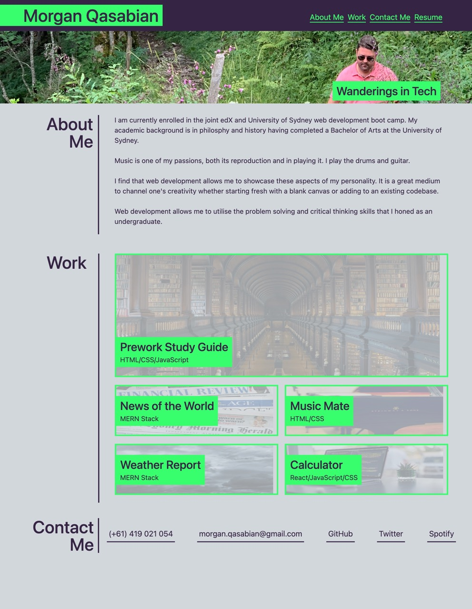

# Morgan Qasabian's Portfolio

## Description

This web application was created as an exercise in CSS stlying to act as a portfolio for my deployed applications. 

Namely this was done for ease of purpose in showcasing my work to potential employers and also to act as an example of my work in itself.

[Deployed GitHub Page](https://mqas1.github.io/morgans-portfolio/)

## Credits

Code written by Morgan Qasabian

## Features

- The use of flex boxes to display icons hyperlinked to my deployed web applications
- Media queries for a more responsive layout
- Pseudo-class use
- Functional navigation bar
